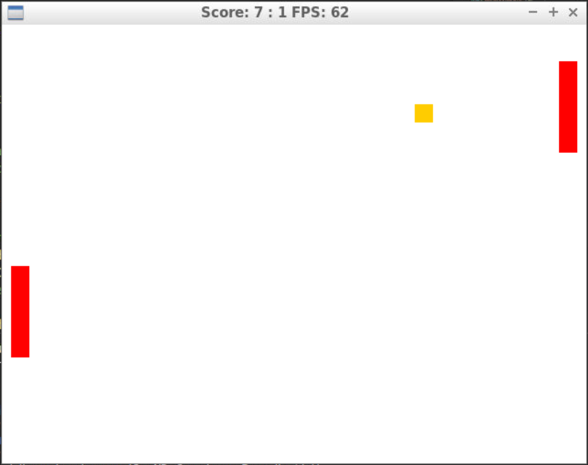

# CPPND: Capstone Pong-clone Repo (Option 2)

This game is the Capstone project in the [Udacity C++ Nanodegree Program](https://www.udacity.com/course/c-plus-plus-nanodegree--nd213) Course (Option 2: clone a classic game).

This Capstone project is inspired on the classic Atari game Pong. This is a simple version of the tennis like game where two players compete to score the ball on the opposite side. 

Currently implemented feautures:
- simplified game rules
- 2 player mode 
- keyboard controls 
- Score on Window title



NOTE: this is a coding exercise and it is not my goal to fully port the original game. Is my intention to implement some more features as a way to further learn C++ and SDL techniques.

## How to play
This is a two player game. Each player controls one of the paddles which can be moved up and down only with following controls:
 
 Left Player controls:
  * key 'w': moves the paddle up
  * key 's': moves the paddle down

 Right player controls:
  * Arrow key up: moves paddle up
  * Arrow key down: moves the paddle down

A Point is scored  each time the ball goes through the opposit side of the field. The ball rebounds on top and bottom boundaries.

To exit the game close the window clicking with the mouse on the top right corner 'x'.

## Dependencies for Running Locally
* cmake >= 3.7
  * All OSes: [click here for installation instructions](https://cmake.org/install/)
* make >= 4.1 (Linux, Mac), 3.81 (Windows)
  * Linux: make is installed by default on most Linux distros
  * Mac: [install Xcode command line tools to get make](https://developer.apple.com/xcode/features/)
  * Windows: [Click here for installation instructions](http://gnuwin32.sourceforge.net/packages/make.htm)
* gcc/g++ >= 5.4
  * Linux: gcc / g++ is installed by default on most Linux distros
  * Mac: same deal as make - [install Xcode command line tools](https://developer.apple.com/xcode/features/)
  * Windows: recommend using [MinGW](http://www.mingw.org/)

## Basic Build and Run Instructions

1. Clone this repo.
2. Make a build directory in the top level directory: `mkdir build && cd build`
3. Compile: `cmake .. && make`
4. Run it: `./PongGame`

## Libraries used in this project (Required)
 This project uses following libraries:
 - SDL <http://www.libsdl.org/>
 - Standard library


## Class Structure (Required)
```bash
`-- src
    |-- IRenderable.h  # Interface for all objects that need to be rendered.
    |-- ball.cpp       # Ball object definition.This class controls the ball movement, speed and physics (e.g. bounces).
    |-- ball.h
    |-- controller.cpp #This class controls the user input.
    |-- controller.h
    |-- game.cpp       # The game class runs the game loop.
    |-- game.h
    |-- main.cpp       # Entry point to the program. Runs the game.
    |-- paddle.cpp     # Class for the paddles instances.
    |-- paddle.h
    |-- renderer.cpp   # Render the game objects to the window.
    `-- renderer.h

```

## Rubric Points addressed (Required)
### Loops, Functions, I/O
| Done   | Criteria               | Meets Specifications
|:---:|------------------------|------------------------------------------|
| &#9745; | The project demonstrates an understanding of C++ functions and control structures. | A variety of control structures are used in the project. |
| &#9745; | The project code is clearly organized into functions. | The project reads data from a file and process the data, or the program writes data to a file. |
| &#9744; | The project reads data from an external file or writes data to a file as part of the necessary operation of the program. | The project accepts user input and processes the input. | The project accepts input from a user as part of the necessary operation of the program.

### Object Oriented Programming
Done | Criteria | Meets Specifications
--- | --- | ---
&#9745; | The project uses Object Oriented Programming techniques. | The project code is organized into classes with class attributes to hold the data, and class methods to perform tasks.
&#9745; | Classes use appropriate access specifiers for class members. | All class data members are explicitly specified as public, protected, or private.
&#9745; | Class constructors utilize member initialization lists. | All class members that are set to argument values are initialized through member initialization lists.
&#9745; | Classes abstract implementation details from their interfaces. | All class member functions document their effects, either through function names, comments, or formal documentation. Member functions do not change program state in undocumented ways.
&#9745; | Classes encapsulate behavior. | Appropriate data and functions are grouped into classes. Member data that is subject to an invariant is hidden from the user. State is accessed via member functions.
&#9745; | Classes follow an appropriate inheritance hierarchy. | Inheritance hierarchies are logical. Composition is used instead of inheritance when appropriate. Abstract classes are composed of pure virtual functions. Override functions are specified.
&#9745; | Overloaded functions allow the same function to operate on different parameters. | One function is overloaded with different signatures for the same function name.
&#9745; | Derived class functions override virtual base class functions. | One member function in an inherited class overrides a virtual base class member function.
&#9744; | Templates generalize functions in the project. | One function is declared with a template that allows it to accept a generic parameter.

### Memory Management
Done | Criteria | Meets Specifications
--- | --- | ---
&#9745; | The project makes use of references in function declarations. | At least two variables are defined as references, or two functions use pass-by-reference in the project code.
&#9744; | The project uses destructors appropriately. | At least one class that uses unmanaged dynamically allocated memory, along with any class that otherwise needs to modify state upon the termination of an object, uses a destructor.
&#9744; | The project uses scope / Resource Acquisition Is Initialization (RAII) where appropriate. | The project follows the Resource Acquisition Is Initialization pattern where appropriate, by allocating objects at compile-time, initializing objects when they are declared, and utilizing scope to ensure their automatic destruction.
&#9744; | The project follows the Rule of 5. | For all classes, if any one of the copy constructor, copy assignment operator, move constructor, move assignment operator, and destructor are defined, then all of these functions are defined.
&#9744; | The project uses move semantics to move data, instead of copying it, where possible. | For classes with move constructors, the project returns objects of that class by value, and relies on the move constructor, instead of copying the object.
&#9744; | The project uses smart pointers instead of raw pointers. | The project uses at least one smart pointer: unique_ptr, shared_ptr, or weak_ptr. The project does not use raw pointers.

### Concurrency
Done | Criteria | Meets Specifications
--- | --- | ---
&#9744; | The project uses multithreading. | The project uses multiple threads in the execution.
&#9744; | A promise and future is used in the project. | A promise and future is used to pass data from a worker thread to a parent thread in the project code.
&#9744; | A mutex or lock is used in the project. | A mutex or lock (e.g. std::lock_guard or `std::unique_lock) is used to protect data that is shared across multiple threads in the project code.
&#9744; | A condition variable is used in the project. | A std::condition_variable is used in the project code to synchronize thread execution.


## References: 
-. "A tour of C++" 2nd Ed from  B. Stipstrout p.54
- const functions: 
  - https://stackoverflow.com/a/8005559
  - https://stackoverflow.com/a/751783
- Interfaces:
  - https://stackoverflow.com/a/270925